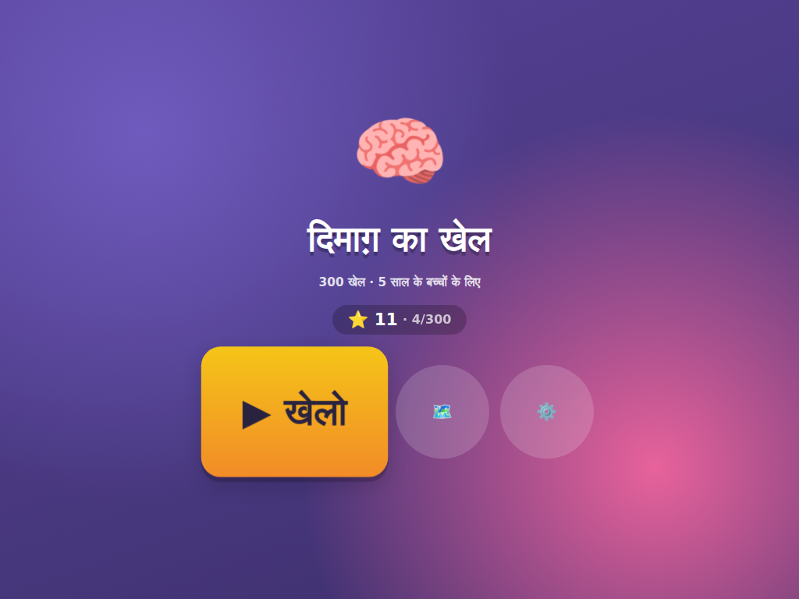
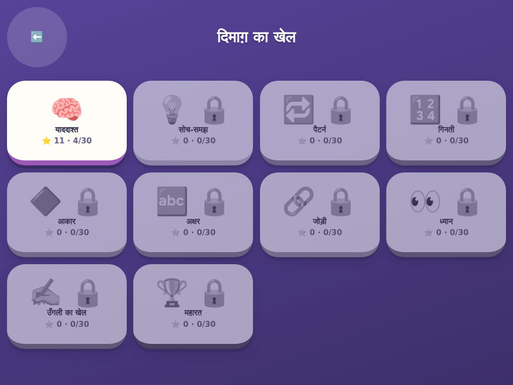
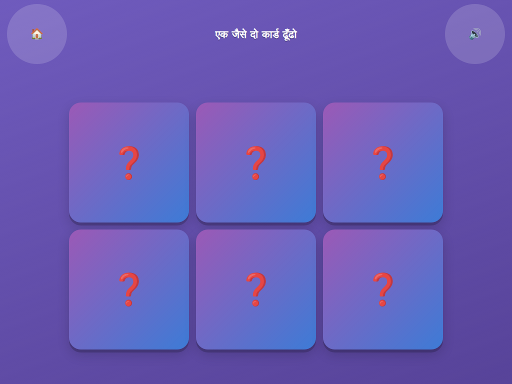
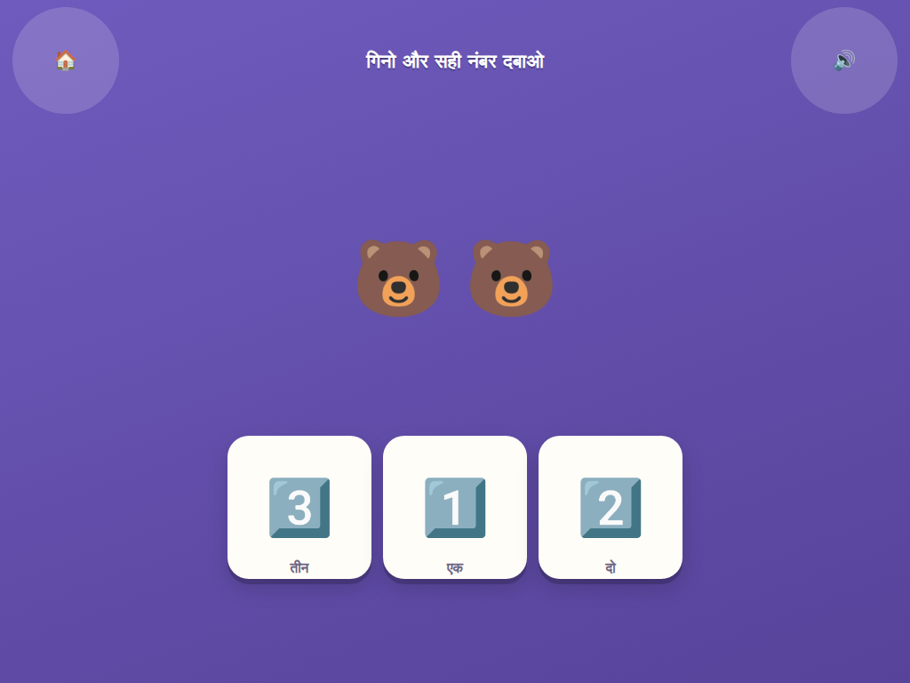
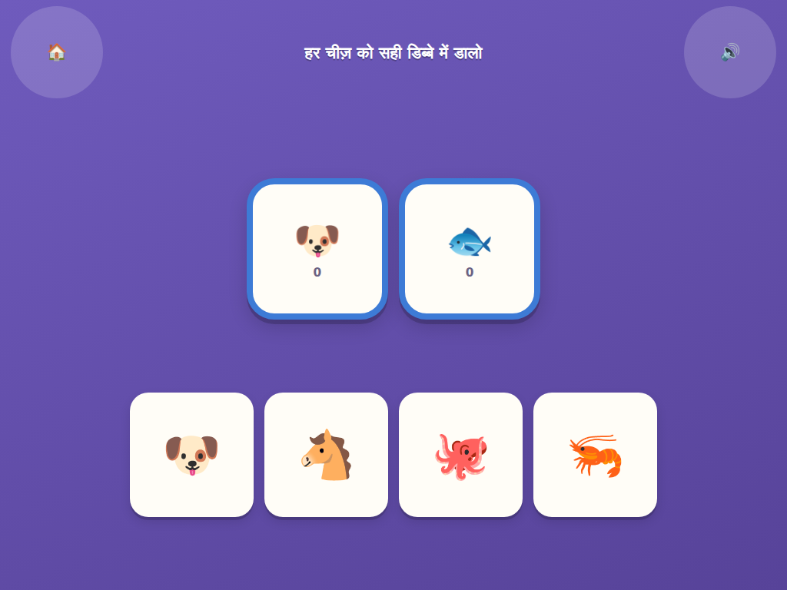
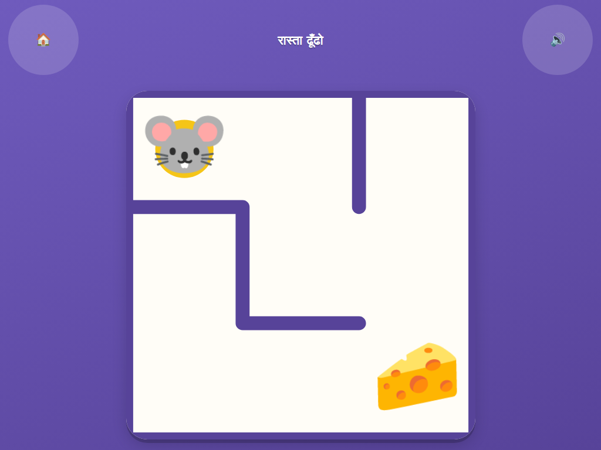
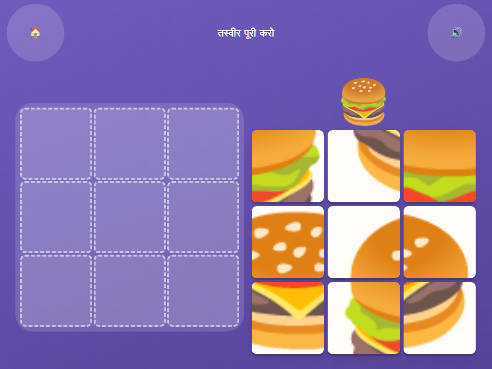
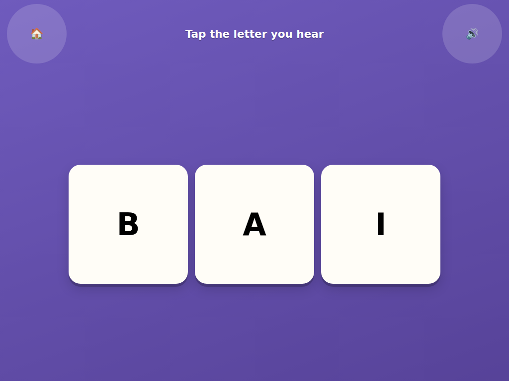

# दिमाग़ का खेल — Mind Games

**300 खेल · 5 साल के बच्चों के लिए · टैबलेट पर**

300 levels of memory, logic, counting, letters and fine-motor games for a
five-year-old, playable on any tablet. Hindi and English, spoken aloud, works
offline, no ads, no purchases, no data collection.

<p align="center">
  
  
</p>
<p align="center">
  
  
  
  
</p>
<p align="center">
  
  
</p>

---

## टैबलेट पर कैसे चलाएँ / Running it on a tablet

**सबसे आसान तरीका (GitHub Pages):**

1. GitHub पर repo खोलो → **Settings → Pages** → Source: `Deploy from a branch`,
   branch चुनो, folder `/ (root)` → **Save**.
2. एक-दो मिनट बाद URL मिलेगा: `https://<username>.github.io/Kid-mind-game-2/`
3. टैबलेट के browser में वो URL खोलो।
4. Browser के मेन्यू में **"Add to Home Screen"** दबाओ। अब ये एक ऐप जैसा
   खुलेगा — पूरी स्क्रीन, बिना इंटरनेट के भी।

**अपने कंप्यूटर पर आज़माने के लिए:**

```bash
python3 -m http.server 8000     # या:  npm run serve
# फिर ब्राउज़र में खोलो: http://localhost:8000
```

There is no build step. It is plain HTML, CSS and ES modules — the folder
you clone is the folder you deploy.

> टैबलेट को **आड़ा (landscape)** रखो। खड़ा रखने पर "टैबलेट घुमाओ" का इशारा आएगा।

---

## बड़ों के लिए / For grown-ups

- **सेटिंग** title screen के ⚙️ बटन में है, पर उसे खोलने के लिए गोल बटन को
  **तीन सेकंड दबाकर रखना** पड़ता है। बच्चा गलती से भाषा नहीं बदल सकता, न ही
  अपने सितारे मिटा सकता है।
- सेटिंग में: भाषा (हिन्दी/English), आवाज़, बोलकर बताना, हिलती-डुलती तस्वीरें,
  और सारी प्रगति मिटाने का बटन।
- सारा डेटा टैबलेट में ही रहता है (`localStorage`)। कोई अकाउंट नहीं, कुछ भी
  इंटरनेट पर नहीं जाता।

---

## Design rules

These are enforced everywhere, and the test suite checks the ones it can:

| Rule | Why |
|---|---|
| **No reading required** | Every instruction is spoken and demonstrated. Text is decoration. |
| **120px minimum touch target** | A five-year-old's fingertip plus their aiming error. The smoke test fails the build if anything is smaller. |
| **Tap and drag only** | No pinch, swipe, double-tap or long-press. Drags snap from 110px away. |
| **No failure state** | No timer, no lives, no "Game Over", no score that goes down. A wrong tap wobbles and nothing else. |
| **Nobody gets stuck** | 2 mistakes → the answer starts pulsing. 4 → the game solves that step itself and moves on. |
| **Adaptive** | Needing help softens the next level of that game; a clean clear firms it back up. |
| **Fits the actual screen** | Tiles never shrink below the touch floor. On a small 7-inch tablet a level shows fewer items rather than a bottom row the child cannot reach. |
| **Locked behind a parent gate** | Settings need a three-second hold. |
| **No ads, purchases, links or tracking** | Nothing leaves the device. |

Colour is never the only signal — every colour-coded thing also carries a
shape or an icon — and `prefers-reduced-motion` is respected.

---

## The 20 games

Each game is one engine. Levels vary the content pack and the difficulty
tier, which is how twenty engines become 300 levels.

| | खेल | Game | What it builds |
|---|---|---|---|
| 🃏 | जोड़ी मिलाओ | Memory match | Working memory |
| 🔍 | कहाँ छुपा है? | Find the hidden one | Visual search |
| 🤔 | अलग कौन सा है? | Odd one out | Categorisation |
| 🧺 | सही डिब्बे में डालो | Sort into bins | Classification |
| 🔁 | आगे क्या आएगा? | Pattern completion | Rule extraction |
| 📶 | छोटे से बड़े | Order by size | Seriation |
| 🔢 | गिनो | Count and tap | Counting 1–10 |
| 📏 | क्रम में लगाओ | Number line | Number order |
| 🔷 | सही जगह रखो | Shape fitting | Shape matching |
| 🧩 | तस्वीर पूरी करो | Jigsaw | Spatial reasoning |
| 🔤 | जो सुना वो दबाओ | Letter recognition | अ-ज्ञ / A–Z |
| 👂 | किस आवाज़ से शुरू? | First sound | Phonological awareness |
| 🔗 | जोड़ी बनाओ | What goes together | Real-world relations |
| 🌑 | परछाई किसकी है? | Shadow match | Shape recognition |
| 🔎 | फ़र्क़ ढूँढो | Spot the difference | Sustained attention |
| 🎹 | दोहराओ | Simon says | Sequence memory |
| ✍️ | लकीर पर उँगली चलाओ | Tracing | Pre-writing control |
| 🌀 | रास्ता ढूँढो | Maze | Planning ahead |
| ➕ | कुल कितने हुए? | Add and subtract | Arithmetic to 10 |
| ⚖️ | ज़्यादा किस तरफ़? | More or fewer | Number sense |

Ten worlds of thirty levels each. A world opens once the previous one is 60%
cleared — not 100%, so one hard game never walls a child off from everything
else.

---

## How it is built

No framework, no bundler, no dependencies at runtime.

| | |
|---|---|
| **Art** | Emoji and inline SVG. **Zero image files.** |
| **Sound** | Synthesised with the Web Audio API. **Zero audio files.** |
| **Voice** | The tablet's own `speechSynthesis`, `hi-IN` and `en-IN`. |
| **Rendering** | DOM and CSS transforms; `<canvas>` only for tracing and the maze. |
| **Input** | Pointer Events, so touch and mouse take one code path. |
| **Storage** | `localStorage`. |
| **Offline** | Service worker, installable as a PWA. |

The whole game is a few hundred kilobytes and loads instantly.

```
index.html            app shell
sw.js                 offline cache
css/                  base tokens, screens, shared game chrome
js/core/              rng, i18n, audio, state, ui, drag, engine, catalog
js/content/           packs.js (128 items), worlds.js
js/games/             20 engines, one file each
js/screens/           hub, map, level select, settings
tools/                icon generator, screenshot and check helpers
docs/                 the screenshots this README links to
tests/                smoke (plays all 300 levels) and offline checks
```

### Adding a game

Add a file to `js/games/`, extend `GameEngine`, and register it in
`js/content/worlds.js`. The base class already provides the top bar, spoken
prompts, mistake handling, the help ladder, stars and the win flow — a new
engine only builds its own play field and calls `this.win()`.

```js
export default class MyGame extends GameEngine {
  static id = 'mygame';
  build(field) { /* build DOM, call this.correct(node) / this.wrong(node) */ }
  hintTarget() { /* what to pulse after 2 mistakes */ }
  solveStep()  { /* how to finish it for them after 4 */ }
  autoSolve()  { /* how the test wins this level */ }
}
```

### Adding content

`js/content/packs.js` holds every item as `{ e, hi, en, c, sz }` — emoji,
Hindi name, English name, colour family, relative size. Adding a pack
immediately gives new levels to every engine that uses generic packs.

---

## Tests

```bash
npm test                                    # all 300 levels
node tests/smoke.mjs --engine memory        # one game
node tests/smoke.mjs --limit 20             # a quick check
node tests/smoke.mjs --viewport 800x600     # a small 7-inch tablet
node tests/smoke.mjs --headed               # watch it play
node tests/offline.mjs                      # works with no network
node tools/check-emoji.mjs                  # no missing glyphs
```

`tests/smoke.mjs` opens every level in Chromium, calls that engine's
`autoSolve()`, and fails unless the level reaches a real win state with a
clean console. On every level it also checks that

- Hindi and English define exactly the same keys,
- every tappable element meets the 120px touch floor,
- no control has been pushed off the edge of the screen, and
- the page never scrolls sideways.

Run it at `--viewport 800x600` as well as the default `1024x768` — the
small-tablet pass is what catches levels that only fit on a big screen.

`tests/offline.mjs` installs the service worker, cuts the network, and
checks the title screen and a cached level still work.

`tools/check-emoji.mjs` renders every emoji in the content packs and fails
on any missing glyph — the whole artwork budget is emoji, so a tofu box is
a content bug.

Development helpers:

```bash
python3 tools/make_icons.py                 # regenerate the PWA icons
node tools/shot.mjs "#/map" out.png         # screenshot a route
node tools/shot-win.mjs memory-0 out.png    # play a level, capture the reward
node tools/shot-settings.mjs out.png        # pass the parent gate, capture settings
```

---

## Licence

Personal project — do what you like with it.
